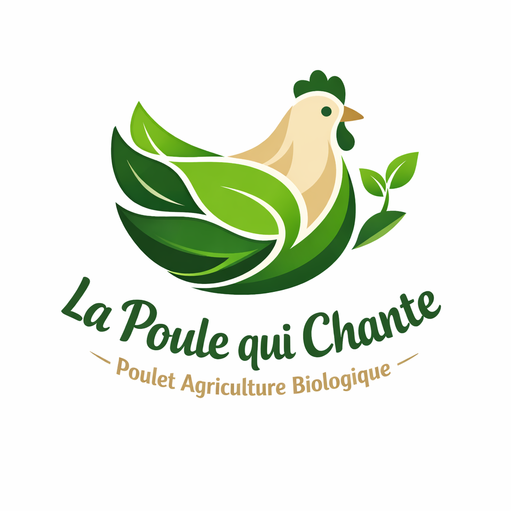
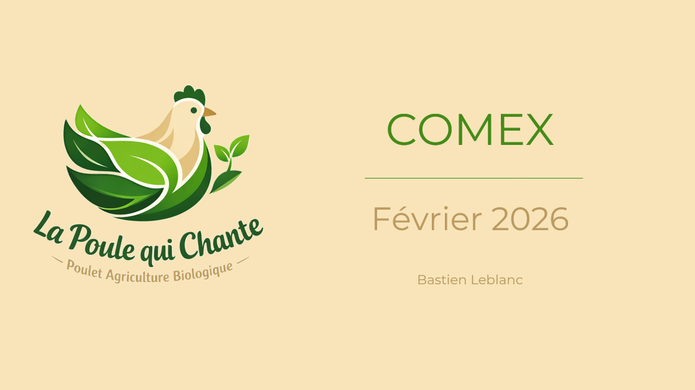

# La Poule Qui Chante
## Projet 11 - OpenClassRooms - Data Analyst

### Contexte :  
La poule qui chante est une entreprise française d’agroalimentaire. 
Sa mission principale est l’élevage et la vente de poulets sous le label “Poulet Agriculture Biologique”. 
Son activité actuelle est franco-française mais le PDG de l’entreprise souhaite évaluer la possibilité de se développer à l'international. 

### Objectif :  
Identifier les pays présentant le plus fort potentiel pour l’exportation de nos poulets Bio.

### Livrables :  
* Présentation PowerPoint ayant pour but de : 

	* Comprendre les dynamiques locales
	* Évaluer la compétitivité du poulet face aux producteurs locaux
	* Prioriser les marchés
	* Pour enfin, formuler des recommandations concrètes de pays ou ensemble de pays.

## Livrables :   
(Clic droit + ouvrir le lien dans un nouvel onglet)

    
<strong>Présentation : </stong>

    

